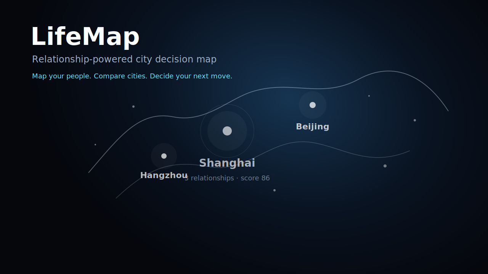

# LifeMap

> A relationship-powered city decision map for choosing where to live and work next.

LifeMap turns personal relationships into a dark, star-like city map. It helps you see which cities already have social support, compare work and lifestyle fit, and make a more grounded decision about your next place to live or work.

[Live Demo](https://your-vercel-demo-url.vercel.app) · [Give LifeMap a Star](https://github.com/sansiyu931-art/lifemap-city-relationship-map)

## Preview



> Replace this cover with a real screenshot or GIF after the public demo is deployed.

## Why LifeMap

Choosing a city is rarely just about salary, rent, or weather. The people you already know can change how safe, supported, and possible a city feels. LifeMap makes those invisible relationships visible, then combines them with city fit signals to support better life and career decisions.

## Features

- **Relationship city map**: friends appear as glowing stars that aggregate into cities as you zoom out.
- **City recommendation score**: combines relationship support, work opportunity, lifestyle fit, cost pressure, and city atmosphere.
- **Dynamic recommendation cards**: highlights the best city options with colorful rotating cards and concise reasons.
- **Recommendation explanation cards**: shows why a city is recommended and which factors contribute most.
- **Personal dashboard**: relationship cities, total relationships, strong relationships, and top recommended cities.
- **Privacy mode**: hides names and only shows relationship type and strength.
- **Demo reset**: restores a clean example dataset for public demos.
- **Import / export**: backs up LifeMap data as JSON and restores it in another browser.
- **Roadmap-ready settings**: entry points for login, multi-device sync, read-only sharing, and AI decision support.

## Product Roadmap

- [x] Dark interactive relationship map
- [x] City detail panel and recommendation ranking
- [x] Import / export local data
- [x] Privacy mode
- [x] Demo data reset
- [x] Dashboard and recommendation explanation
- [ ] GitHub + Vercel public deployment
- [ ] Supabase login and per-user cloud data
- [ ] Multi-device real-time sync
- [ ] Read-only anonymized sharing links
- [ ] AI assistant for next-step city decisions

## Tech Stack

- **Frontend**: HTML, CSS, JavaScript
- **Visualization**: Canvas-based interactive globe/map rendering
- **Local persistence**: `localStorage` with JSON import/export
- **Planned auth & database**: Supabase
- **Planned deployment**: Vercel

## Getting Started

This version runs as a static webpage.

```bash
git clone https://github.com/sansiyu931-art/lifemap-city-relationship-map.git
cd lifemap-city-relationship-map
open index.html
```

You can also serve it locally:

```bash
python3 -m http.server 5173
```

Then open:

```text
http://localhost:5173
```

## Privacy

LifeMap is designed with public presentation in mind:

- The public demo should use example or anonymized data.
- Real relationship data should not be committed to GitHub.
- Privacy mode hides names in the interface.
- Future Supabase integration will isolate each user's data by account.

## Resume Highlights

LifeMap demonstrates:

- Product thinking around life/career decision support.
- Data visualization for relationship and city signals.
- Interactive canvas rendering with zoom-level information density.
- Local data persistence, import/export, and privacy mode.
- A practical roadmap toward authentication, cloud sync, and AI assistance.

## Contributing

Ideas, feedback, and stars are welcome. If LifeMap feels useful or interesting, please consider giving the repository a star.
